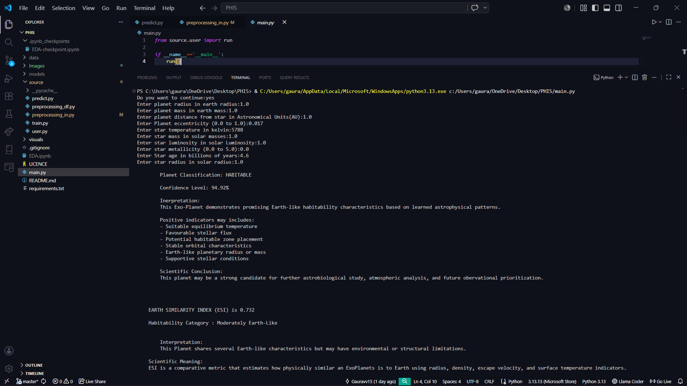
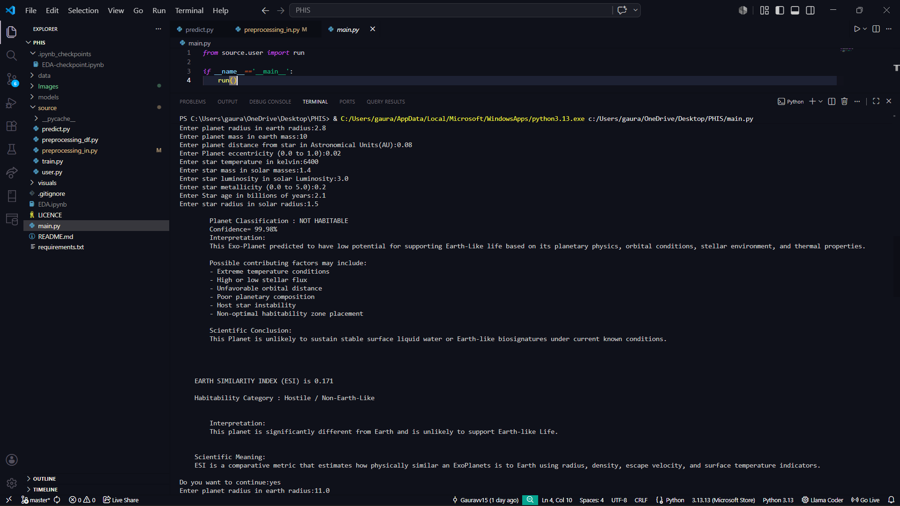
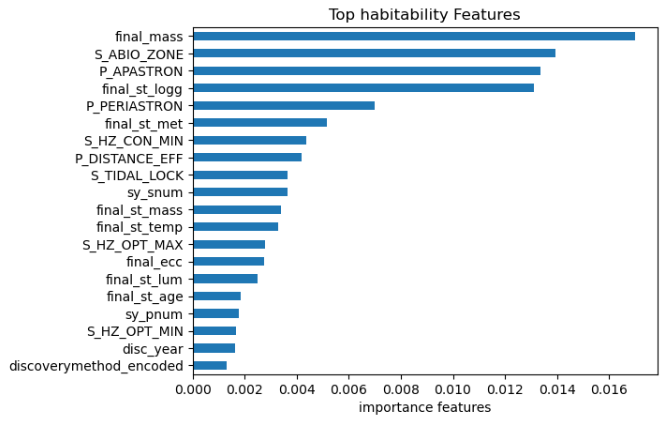
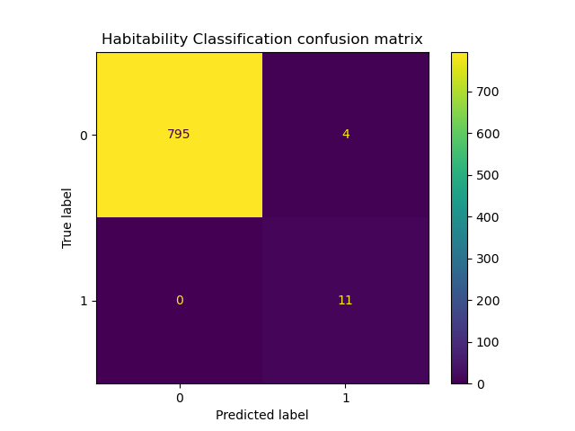
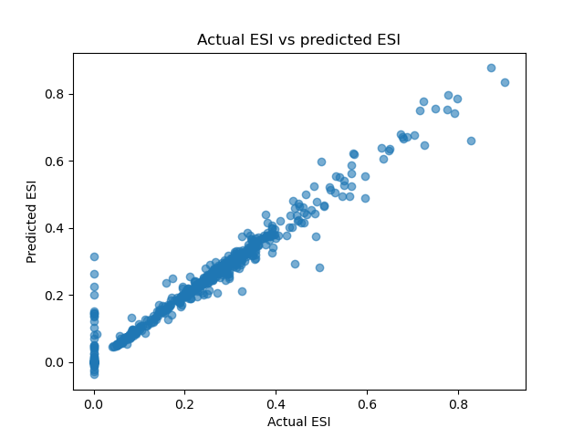

# PHIS — Planetary Habitability Intelligence System
### Machine Learning Framework for Exoplanet Habitability Classification and Earth Similarity Prediction

## Overview
PHIS (Planetary Habitability Intelligence System) is an astronomy-focused machine learning project designed to evaluate exoplanets for potential habitability and predict their Earth Similarity Index (ESI) using astrophysical, planetary, orbital, and stellar parameters.

By integrating NASA Exoplanet Archive data with Planetary Habitability Laboratory (PHL) datasets, PHIS creates a robust predictive framework capable of:

- Classifying whether an exoplanet is potentially habitable
- Predicting Earth Similarity Index (ESI)
- Engineering scientific features using astrophysical formulas
- Simulating real-world planetary habitability analysis

This project combines data science, astronomy, and machine learning into a portfolio-grade scientific system.

---

## Key Features

### Data Integration
- NASA Exoplanet Archive dataset
- Planetary Habitability Laboratory (PHL) dataset
- Cross-dataset feature merging using cleaned planetary identifiers

### Advanced Feature Engineering
PHIS calculates critical astrophysical features including:

- Orbital Period (Kepler’s Third Law)
- Stellar Flux
- Equilibrium Temperature
- Periastron & Apastron distances
- Effective orbital distance
- Stellar surface gravity (log g)
- Conservative and optimistic habitable zone boundaries
- Abiogenesis zone estimation
- Tidal locking probability
- Planet type classification (Terran, SuperTerran, Neptunian, Jovian)

### Machine Learning Models
#### Habitability Classification:
- XGBoost Classifier
- SMOTE for class imbalance correction
- High recall optimization for habitable planets

#### ESI Prediction:
- XGBoost Regressor
- Regression analysis for Earth similarity scoring

### Performance
#### Classification:
- Accuracy: ~99.6%
- High recall for habitable class
- Strong macro F1 score

#### Regression:
- R² Score: ~0.94
- Low MAE
- Reliable ESI prediction consistency

---

## Project Structure
```bash
PHIS/
│── data/                     # Raw NASA + PHL datasets
│── models/                   # Saved ML models, encoders, scaler
│   ├── xgb_habitability_model.pkl
│   ├── xgb_esi_model.pkl
│   ├── scaler.pkl
│   ├── le_disc.pkl
│   ├── le_ptype.pkl
│   └── df_cols.pkl
│
│── source/
│   ├── preprocessing_df.py   # Training data preprocessing
│   ├── preprocessing_in.py   # User input preprocessing + feature engineering
│   ├── train.py              # Model training pipeline
│   ├── predict.py            # Prediction + scientific interpretation
│   └── user.py               # User interaction system
│
│── visuals/                  # EDA, feature importance, confusion matrix, residuals
│── main.py                   # Main execution file
│── requirements.txt
│── LICENSE
│── README.md
└── .gitignore
```
---

## Installation

### Clone Repository
```bash
git clone https://github.com/Gauravvv15/PHIS---Planetary-Habitability-Intelligence-System.git
cd PHIS
```

### Install Dependencies
```bash
pip install -r requirements.txt
```

---

## Requirements
```txt
pandas
numpy
scikit-learn
xgboost
imbalanced-learn
matplotlib
seaborn
joblib
requests
```

---

## How It Works

### Training Pipeline
1. Load NASA + PHL datasets
2. Clean and merge datasets
3. Feature engineering
4. Missing value imputation
5. Label encoding
6. Robust scaling
7. Train/test split
8. SMOTE balancing
9. Train XGBoost classifier and regressor
10. Save trained models

### Prediction Pipeline
User inputs:
- Planet radius
- Planet mass
- Orbital distance
- Eccentricity
- Stellar temperature
- Stellar mass
- Stellar luminosity
- Stellar metallicity
- Stellar age
- Stellar radius

PHIS then:
- Engineers scientific features
- Applies scaler/encoders
- Predicts habitability probability
- Predicts Earth Similarity Index
- Provides scientific interpretation

---

---

## Example Output & Live Verification

### Pipeline Execution & Dynamic Classification
The interactive inference framework accepts multi-parametric planetary telemetry vectors to output high-fidelity classifications alongside scientific astrobiological interpretations.

<p align="center">
  
  <br>
  <em>Figure 1.0: Real-time CLI evaluation identifying a prospective habitable target candidate with 94.92% classification confidence and a calculated 0.732 Earth Similarity Index (ESI).</em>
</p>

<p align="center">
  
  <br>
  <em>Figure 1.1: Live model response correctly isolating a non-habitable exoplanetary target with extreme stellar properties at 99.98% confidence.</em>
</p>

<p align="center">
  
  <br>
  <em>Figure 1.2: Interactive validation processing a high-mass Jovian analog target scale, properly sorting structural planetary physical restrictions.</em>
</p>

```bash
Planet Classification: HABITABLE
Confidence Level: 94.92%

Earth Similarity Index (ESI): 0.733
Habitability Category: Moderately Earth-Like
---

## Scientific Significance
PHIS is not just a machine learning project — it represents a practical simulation of computational astrobiology.

### Applications:
- Exoplanet candidate prioritization
- Habitability analysis
- Astrobiological research support
- Astronomy-focused ML portfolio development
- Future integration with live NASA databases

---
```
## Visualizations Included

### 1. Astrophysical Boundary Benchmarks
To evaluate the biological potential of predicted candidates, model inferences are framed alongside empirical solar luminosity and temperature distributions within stable liquid water zones.

<p align="center">
  
  <br>
  <em>Figure 2.0: Structural alignment of validated rocky exoplanetary arrays across conservative and optimistic orbital boundaries relative to their parent stars.</em>
</p>

### 2. Multi-Parametric Feature Importance Layouts
Computed via gradient boosting estimators, these parameters highlight the deterministic feature dependencies separating planetary classification architectures from regression scoring arrays.

<p align="center">
  
  
  <br>
  <em>Figure 3.0: Comparative feature weight profiles mapping dominant factors influencing structural Earth Similarity scaling calculations (left) versus strict categorical habitability thresholds (right).</em>
</p>

### 3. Model Accuracy & Linear Prediction Diagnostics
Statistical performance metrics evaluate model variance, highlighting precision-recall behavior and error-margin density across target data streams.

<p align="center">
  
  
  <br>
  <em>Figure 4.0: Left: Confusion matrix illustrating optimal classification performance under extreme class imbalances. Right: Regression plot validating prediction tracking accuracy against calculated ESI benchmarks.</em>
</p>

---

## Future Improvements
### Planned Upgrades:
- Streamlit web deployment
- Live NASA API integration
- Interactive dashboard
- PDF scientific report generation
- Planet comparison tools
- Deep learning enhancements
- Automated candidate ranking system

---

## Project Strengths
- Real scientific domain application
- High-performance ML architecture
- Strong feature engineering
- Production-ready model storage
- User interaction support
- Research scalability

---

## Author
### Gaurav
AIML Student | Data Science & Astronomy Enthusiast

Focused on building machine learning systems for:
- Astronomy
- Planetary science
- Scientific AI applications

---

## License
This project is licensed under the MIT License.

---

## Final Note
PHIS demonstrates how machine learning can be combined with astrophysical science to build intelligent systems capable of exploring one of humanity’s greatest questions:

### *Could another Earth exist?*

